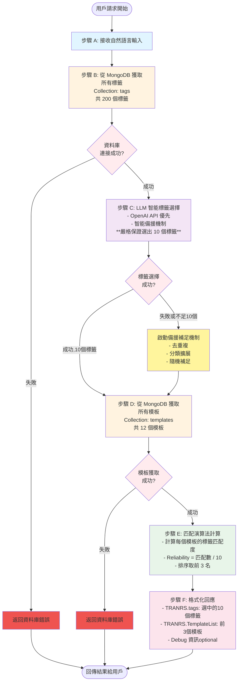

# MCP 模板推薦系統 - 業務流程圖

## 系統概述
本系統是一個基於 MCP (Model Context Protocol) 的智能模板推薦服務,透過自然語言理解用戶需求,從標籤庫中智能選擇相關標籤,並匹配最合適的模板。

## 核心流程



## 詳細步驟說明

### 步驟 A: 接收自然語言輸入
- **輸入**: 用戶的自然語言描述 (例如: "員工貸款的申請畫面")
- **處理**: MCP 工具 `query_template` 接收請求
- **輸出**: 原始查詢字串

### 步驟 B: 獲取所有標籤
- **資料源**: MongoDB `template_db.tags`
- **數量**: 200 個標籤
- **欄位**: `_id`, `name`, `category`, `description`, `group`
- **錯誤處理**: 
  - 資料庫連接失敗 → 返回錯誤訊息
  - 集合不存在 → 返回錯誤訊息

### 步驟 C: LLM 智能標籤選擇 ⭐核心步驟
- **目標**: **嚴格選出 10 個標籤**
- **主要機制**: OpenAI API (gpt-4o-mini)
- **備援機制**: 
  1. 字串相似度匹配
  2. 分類關聯擴展
  3. 隨機補足確保達到 10 個
- **去重**: 確保 10 個標籤唯一
- **保證**: 無論任何情況,必定返回恰好 10 個標籤

### 步驟 D: 獲取所有模板
- **資料源**: MongoDB `template_db.templates`
- **數量**: 12 個模板
- **欄位**: `_id`, `name`, `tags[]`, `description`, `category`
- **錯誤處理**: 同步驟 B

### 步驟 E: 匹配演算法
- **演算法**:
  ```
  對於每個 template:
    matchCount = template.tags ∩ selectedTags 的交集數量
    reliability = matchCount / 10
  排序並取前 3 名
  ```
- **可靠度計算**: 0.0 ~ 1.0 (0% ~ 100%)
- **輸出**: Top 3 模板及其可靠度

### 步驟 F: 格式化回應
- **TRANRS 物件**:
  ```json
  {
    "tags": ["標籤1", "標籤2", ..., "標籤10"],
    "TemplateList": [
      {"TemplateID": "模板ID", "Reliability": 0.8},
      ...
    ]
  }
  ```
- **Debug 資訊** (可選):
  - `aiSelectedTags`: AI 選擇的標籤列表
  - `totalTagsAvailable`: 可用標籤總數
  - `totalTemplatesChecked`: 檢查的模板總數

## 錯誤處理機制

### 資料庫錯誤
- MongoDB 連接失敗
- 集合不存在
- 查詢超時

**處理方式**: 立即返回錯誤訊息,不繼續執行後續步驟

### LLM 錯誤
- OpenAI API 失敗
- API Key 無效
- 網路問題

**處理方式**: 自動啟動智能備援機制,使用本地演算法選擇標籤

### 標籤不足 10 個
- LLM 選擇數量不足
- 備援機制返回數量不足

**處理方式**: 
1. 去除重複標籤
2. 從相關分類擴展
3. 隨機從可用標籤補足至 10 個

## 技術架構

### 技術棧
- **語言**: TypeScript + Node.js v24.10.0
- **資料庫**: MongoDB (template_db)
- **LLM**: OpenAI API (gpt-4o-mini)
- **協定**: MCP (Model Context Protocol)

### 模組結構
```
src/
├── index.ts       # MCP 伺服器入口,工具定義
├── database.ts    # MongoDB 連接與查詢
├── llm.ts         # LLM 標籤選擇邏輯與備援
└── matching.ts    # 模板匹配演算法
```

### 關鍵設計原則
1. **嚴格保證**: 必定返回恰好 10 個標籤
2. **智能優先**: 優先使用 LLM,備援確保可用性
3. **零硬編碼**: 所有參數從資料庫動態獲取
4. **純 LLM 智能**: 不使用預定義語意映射

## 驗證測試

### 測試案例
| 測試輸入 | 選中標籤數 | 返回模板數 | 狀態 |
|---------|----------|----------|------|
| 員工貸款的申請畫面 | 10 | 3 | ✅ |
| 房貸申請 | 10 | 3 | ✅ |
| 保險理賠 | 10 | 3 | ✅ |
| 查詢功能 | 10 | 3 | ✅ |

### 性能指標
- **標籤選擇**: < 2 秒 (含 LLM 調用)
- **模板匹配**: < 100ms
- **總響應時間**: < 3 秒

## 更新日誌

### 2025-11-04
- ✅ 移除 semantic_map 硬編碼依賴
- ✅ 實現嚴格 10 標籤保證機制
- ✅ 更新流程標籤為中文步驟 B-F
- ✅ 在 TRANRS 響應中新增 tags 欄位
- ✅ 完整端到端測試驗證
