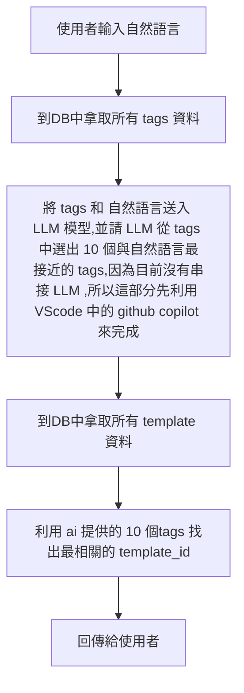

```mermaid
flowchart TD;
    A --> B;
    B --> C;
    C --> D;
    D --> E;
    E --> F;


    A[使用者輸入自然語言]
    B[到DB中拿取所有 tags 資料]
    C[將 tags 和 自然語言送入 LLM 模型,並請 LLM 從 tags 中選出 10 個與自然語言最接近的 tags,因為目前沒有串接 LLM ,所以這部分先利用 VScode 中的 github copilot 來完成]
    D[到DB中拿取所有 template 資料]
    E[利用 ai 提供的 10 個tags 找出最相關的 template_id]
    F[回傳給使用者]


```
