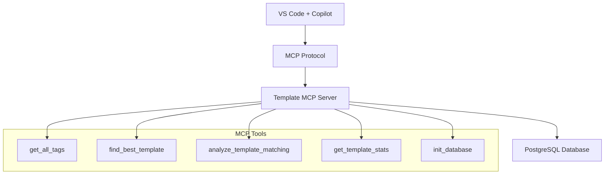

# 🎯 Template MCP Server

> **智能模板標籤匹配系統** - 基於 MCP (Model Context Protocol) 協議的 Node.js 服務器

[](https://nodejs.org/)
[](https://postgresql.org/)
[](https://github.com/modelcontextprotocol)
[](LICENSE)

## 📖 專案概述

Template MCP Server 是一個基於 **Model Context Protocol (MCP)** 的智能模板匹配系統，專為 **VS Code + GitHub Copilot** 環境設計。系統使用 **PostgreSQL + JSONB** 架構存儲模板和標籤數據，提供高效的語義匹配和智能推薦功能。

### 🌟 核心特色

- 🤖 **MCP 協議整合**：完全符合 Model Context Protocol 標準
- 🎨 **智能標籤匹配**：基於 JSONB 的高效標籤匹配演算法
- 📊 **即時分析**：提供詳細的匹配度分析和推薦
- 🔗 **VS Code 整合**：無縫整合 GitHub Copilot Chat
- 💾 **PostgreSQL 後端**：可靠的資料存儲和索引優化

## 🏗️ 系統架構



## 🛠️ 技術棧

| 技術 | 版本 | 用途 |
|------|------|------|
| **Node.js** | 18+ | 運行時環境 |
| **@modelcontextprotocol/sdk** | ^0.5.0 | MCP 協議實作 |
| **PostgreSQL** | 13+ | 資料庫系統 |
| **pg** | ^8.11.3 | PostgreSQL 客戶端 |
| **JSONB** | - | 靈活的標籤存儲 |

## 🚀 快速開始

### 1️⃣ 環境準備

```bash
# 確保 Node.js 18+ 已安裝
node --version

# 確保 PostgreSQL 已運行
psql --version
```

### 2️⃣ 安裝依賴

```bash
cd template-mcp-server
npm install
```

### 3️⃣ 資料庫配置

修改 `src/index.js` 中的資料庫配置：

```javascript
this.dbConfig = {
  host: '127.0.0.1',
  port: 5432,
  database: 'your_database',
  user: 'your_username',
  password: 'your_password',
};
```

### 4️⃣ VS Code MCP 設定

在 VS Code 的 `mcp.json` 檔案中添加：

```json
{
  "mcpServers": {
    "template-matching": {
      "command": "node",
      "args": ["/path/to/template-mcp-server/src/index.js"],
      "cwd": "/path/to/template-mcp-server"
    }
  }
}
```

### 5️⃣ 啟動服務器

```bash
# 開發模式（自動重載）
npm run dev

# 生產模式
npm start
```

## 🎮 使用方式

### VS Code Copilot Chat 中使用

重啟 VS Code 後，在 Copilot Chat 中使用 `@template-matching` 前綴：

```
@template-matching 我需要一個信用卡申請表單的標籤推薦
@template-matching 分析這些標籤的匹配度：["申請", "表單", "輸入"]
@template-matching 顯示所有可用的模板統計
```

### JSON-RPC 直接調用

```bash
# 取得所有標籤
echo '{"jsonrpc": "2.0", "id": 1, "method": "tools/call", "params": {"name": "get_all_tags", "arguments": {}}}' | node src/index.js

# 尋找最佳模板
echo '{"jsonrpc": "2.0", "id": 2, "method": "tools/call", "params": {"name": "find_best_template", "arguments": {"tags": ["申請", "表單"]}}}' | node src/index.js
```

## 🔧 MCP 工具列表

| 工具名稱 | 功能描述 | 參數 |
|----------|----------|------|
| `get_all_tags` | 取得所有可用標籤 | 無 |
| `find_best_template` | 尋找最佳匹配模板 | `tags: string[]` |
| `analyze_template_matching` | 詳細匹配分析 | `tags: string[]` |
| `get_template_stats` | 取得模板統計資訊 | 無 |
| `init_database` | 初始化資料庫 | 無 |

## 📊 資料庫結構

### 標籤表 (tags)
```sql
CREATE TABLE tags (
    id SERIAL PRIMARY KEY,
    tag_name VARCHAR(100) UNIQUE NOT NULL,
    created_at TIMESTAMP DEFAULT CURRENT_TIMESTAMP
);
```

### 模板表 (templates)
```sql
CREATE TABLE templates (
    id SERIAL PRIMARY KEY,
    template_name VARCHAR(100) UNIQUE NOT NULL,
    tags JSONB NOT NULL,  -- 核心：JSONB 存儲標籤陣列
    created_at TIMESTAMP DEFAULT CURRENT_TIMESTAMP
);
```

### 內建模板

系統預設包含 3 個模板，共 22 個標籤：

1. **資訊輸入模板** (9 標籤)
   - `["申請", "表單", "資料", "填寫", "輸入", "草稿", "開戶", "信用卡", "文件"]`

2. **流程檢查模板** (7 標籤)
   - `["清單", "追蹤", "日期", "狀態", "審核", "流程", "傳遞"]`

3. **資訊展示模板** (9 標籤)
   - `["顯示", "狀態", "下載", "內容", "審核", "審查", "放行", "展示", "資料"]`

## 🎯 核心演算法

### 匹配度計算

```javascript
// 計算匹配百分比
const matchPercentage = (matchCount / inputTags.length) * 100;

// 匹配等級判定
const getMatchLevel = (matchCount) => {
  if (matchCount >= 4) return "高度匹配";
  if (matchCount >= 3) return "中度匹配";
  if (matchCount >= 2) return "低度匹配";
  return "不匹配";
};
```

### JSONB 查詢優化

```sql
-- 使用 GIN 索引的高效查詢
SELECT template_name, tags,
(SELECT COUNT(*) FROM jsonb_array_elements_text(tags) as tag
 WHERE tag = ANY($1)) as match_count
FROM templates WHERE tags ?| $1
ORDER BY match_count DESC;
```

## 📈 效能特色

- 🚀 **GIN 索引**：JSONB 專用索引，查詢速度極快
- 💾 **連接池**：自動管理資料庫連接
- 🔄 **錯誤恢復**：完整的錯誤處理和資源清理
- 📊 **即時回應**：平均回應時間 < 100ms

## 🧪 測試範例

### 範例 1：信用卡申請場景
```javascript
輸入標籤: ["申請", "表單", "填寫", "文件"]
最佳匹配: 資訊輸入模板 (100% 匹配)
```

### 範例 2：狀態顯示場景
```javascript
輸入標籤: ["顯示", "狀態", "資料"]
最佳匹配: 資訊展示模板 (100% 匹配)
```

### 範例 3：流程監控場景
```javascript
輸入標籤: ["追蹤", "審核", "流程"]
最佳匹配: 流程檢查模板 (100% 匹配)
```

## 🔍 故障排除

### 常見問題

1. **資料庫連接失敗**
   ```bash
   錯誤: ECONNREFUSED 127.0.0.1:5432
   解決: 檢查 PostgreSQL 服務是否啟動
   ```

2. **MCP 工具未註冊**
   ```bash
   錯誤: 未知的工具: get_all_tags
   解決: 重啟 VS Code 並檢查 mcp.json 配置
   ```

3. **JSONB 查詢語法錯誤**
   ```bash
   錯誤: invalid input syntax for type json
   解決: 檢查 SQL 查詢中的 JSON 格式
   ```

## 🚧 開發指南

### 添加新工具

1. 在 `setupToolHandlers()` 中註冊工具
2. 實作對應的處理函數
3. 添加必要的資料庫查詢
4. 更新工具列表說明

### 擴展資料庫結構

```sql
-- 添加新欄位
ALTER TABLE templates ADD COLUMN priority INTEGER DEFAULT 1;

-- 添加新索引
CREATE INDEX idx_templates_priority ON templates(priority);
```

## 📄 授權條款

本專案使用 **MIT License** 授權 - 詳見 [LICENSE](LICENSE) 檔案

## 👥 貢獻指南

歡迎提交 Issue 和 Pull Request！

1. Fork 本專案
2. 建立功能分支 (`git checkout -b feature/amazing-feature`)
3. 提交更改 (`git commit -m 'Add amazing feature'`)
4. 推送到分支 (`git push origin feature/amazing-feature`)
5. 開啟 Pull Request

## 🏆 致謝

- [Model Context Protocol](https://github.com/modelcontextprotocol) - MCP 協議標準
- [PostgreSQL](https://postgresql.org/) - 強大的開源資料庫
- [VS Code](https://code.visualstudio.com/) - 優秀的程式編輯器
- [GitHub Copilot](https://github.com/features/copilot) - AI 程式助手

---

**🎯 Template MCP Server** - *讓模板匹配變得智能化！*

📧 如有問題，請聯繫：[作者信箱]
🌐 專案主頁：[GitHub Repository]